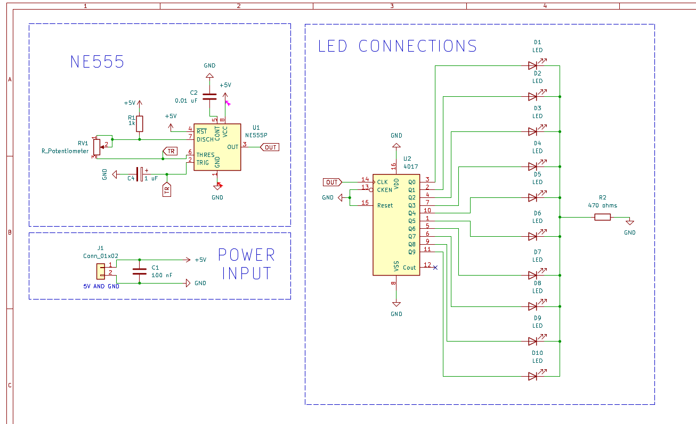
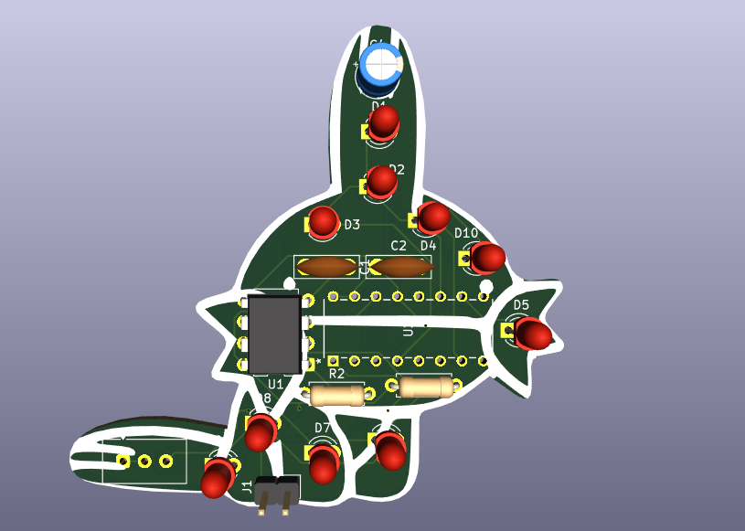

# Mudkip Themed LED Chaser using NE555

this is a cool mudkip themed led chaser built using a ne555 timer and cd4017 decade counter. the 555 is configured in astable mode to generate clock pulses, and the 4017 drives 10 leds one by one to create a smooth chasing effect.

the pcb outline is shaped like mudkip, and the leds are arranged along the body to make the animation flow across the board.

---

## how it works

- the ne555 is set in astable mode to generate continuous clock pulses  
- the cd4017 receives those pulses and activates outputs q0 to q9 sequentially  
- each output drives one led  
- only one led is on at a time, creating the chasing effect  

the board runs on 5v and uses through hole components for easy soldering.

---

## schematic

---

## 3d view

---

## pcb details

- 2 layer pcb  
- custom mudkip shaped outline  
- ground plane on bottom layer  
- 1oz copper  
- 1.6mm thickness  

---

## what i learned

- configuring the 555 in astable mode  
- using the cd4017 decade counter  
- designing a custom shaped pcb  
- routing a tight board layout  
- generating gerbers and preparing for manufacturing  

---

this project combines basic electronics with creative pcb design and fabrication.
